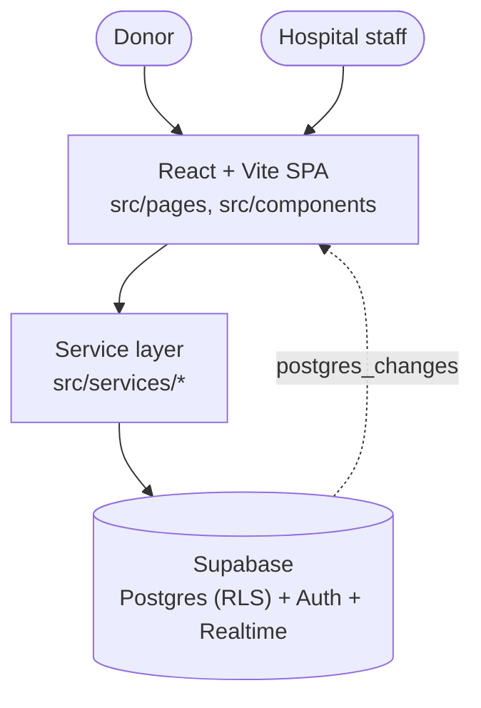

# HealthConnect Now

**Real-time blood & organ donation coordination for hospitals and donors.**

HealthConnect Now connects hospitals and donors so blood, organs, and other
emergency resources move as fast as the situation demands. A hospital
publishes its blood stock, ICU bed capacity, and organ availability, and can
broadcast a resource request to every other hospital or send a targeted
blood request to a specific available donor. Donors set their availability
once and get notified the moment a nearby hospital needs their blood type —
accept, and it's tracked through to donation history.

There is no custom backend server: the app talks to Supabase directly, and
Row Level Security is what keeps one hospital's or donor's data from another.

## How it works

1. **Someone registers** — as a hospital (name, license number, contact) or
   a donor (name, blood group, location, availability) via
   `/register/hospital` or `/register/donor`. This creates a Supabase Auth
   account plus a `profiles` row and a `user_roles` row.
2. **Hospitals manage their resources** — blood stock by group, ICU bed
   occupancy, and organ availability, each readable/writable only by that
   hospital (`src/services/bloodStockService.ts`, `icuBedsService.ts`,
   `organService.ts`).
3. **Hospitals request what they need** — broadcast a blood/organ request to
   every other registered hospital, send a disaster/emergency alert the same
   way, or send a targeted blood request to one available donor
   (`SendRequestPage`, `HospitalEmergencyRequestPage`, `SearchDonorsPage`).
4. **The other side responds** — a hospital accepts or rejects an incoming
   request (`IncomingRequestsPage`); a donor accepts or declines a request
   addressed to them (`EmergencyRequestsPage`), which also creates a
   `donation_history` record the donor can later mark completed.
5. **Everyone stays in sync** — a notification bell polls for status changes
   every 15 seconds, and a donor's own profile updates live via a Supabase
   Realtime subscription the moment their availability changes elsewhere.

## Architecture



Every Supabase call in the app — auth, every table read/write, the one
Realtime subscription — goes through a typed module in `src/services/`
(`authService`, `profileService`, `bloodStockService`, `requestService`,
`icuBedsService`, `organService`, `donationService`). Pages never construct
a Supabase query directly; they call a service function and get back a
plain `{ data, error }`. That's a deliberate boundary: swapping the backend
later means reimplementing these seven files, not hunting for scattered
`supabase.from(...)` calls across twenty pages.

| Layer | Tech |
|---|---|
| Frontend | React 18 + TypeScript + [Vite](https://vitejs.dev/) |
| UI | [shadcn-ui](https://ui.shadcn.com/) (Radix UI primitives) + [Tailwind CSS](https://tailwindcss.com/) |
| Routing | React Router v6, with role-gated protected routes (`ProtectedRoute` in `src/App.tsx`) |
| Data access | A typed service layer (`src/services/`) over the Supabase JS client — no custom backend server |
| Backend | [Supabase](https://supabase.com/) — Postgres with Row Level Security, email/password Auth, Realtime |
| Local dev backend | Supabase CLI (`supabase/config.toml` + `supabase/migrations/`) |
| Testing | [Vitest](https://vitest.dev/) + Testing Library (unit), [Playwright](https://playwright.dev/) (e2e scaffold) |

## Data model

Every table below has Row Level Security enabled and is scoped by
`auth.uid()` to the hospital or donor that owns each row (see
`supabase/migrations/`). Since there's no backend server or service-role
key involved in normal use, RLS is the only thing standing between a
signed-in user and someone else's data.

| Table | Owner | Purpose |
|---|---|---|
| `profiles` | self | Name, contact info, hospital license number, or donor blood group + availability |
| `user_roles` | self | `hospital` or `donor` |
| `blood_stock` | hospital | Units on hand per blood group |
| `resource_requests` | sender + recipient | Hospital→hospital and hospital→donor blood/organ requests, with status (`pending`/`accepted`/`rejected`) |
| `icu_beds` | hospital | Total and occupied ICU bed counts |
| `organ_availability` | hospital | Available count per organ (+ optional blood type) |
| `donation_history` | donor | Created when a donor accepts a request; the donor marks it `completed` after donating |

## Project structure

```
.
├── src/
│   ├── pages/
│   │   ├── donor/               # Profile, availability, donation history, emergency requests
│   │   └── hospital/            # Dashboard, blood stock, ICU beds, organs, requests
│   ├── components/               # Navbar, Footer, notifications, LogoutConfirmDialog, ui/ (shadcn kit)
│   ├── services/                 # The only files that import the Supabase client
│   ├── contexts/                 # AuthContext — session + role-aware user state
│   ├── hooks/                    # use-toast, use-mobile
│   ├── integrations/supabase/    # Supabase client (env-driven — see Getting Started)
│   ├── lib/                      # Shared types + constants (blood groups, organ types)
│   └── test/                     # Vitest setup
├── supabase/
│   ├── config.toml                # Local Supabase CLI config
│   └── migrations/                # Full schema history, replayable via `supabase start`
└── public/
```

## Getting started

### Prerequisites

- Node.js 18+ and npm
- A Supabase project — the app points at a preconfigured hosted project by
  default, or you can run one locally (see below)

### Install & run

```bash
npm install
npm run dev
```

The dev server binds to `::` (all interfaces) on port 8080 per
`vite.config.ts`; on a host without IPv6 support, run
`npx vite --host 127.0.0.1` instead.

### Point it at your own Supabase project (optional)

By default `src/integrations/supabase/client.ts` falls back to a
preconfigured hosted project. To use your own instead:

```bash
cp .env.local.example .env.local
# fill in VITE_SUPABASE_URL and VITE_SUPABASE_ANON_KEY
```

### Run entirely locally, no hosted project needed

```bash
npx supabase start   # requires Docker; applies every migration in supabase/migrations/
# copy the printed API URL and anon key into .env.local
npm run dev
```

### Testing & linting

```bash
npm run test    # Vitest
npm run lint    # ESLint
npm run build   # production build
```

## Deployment

This is a static single-page app — `npm run build` produces a `dist/`
directory deployable to any static host (Vercel, Netlify, Cloudflare Pages,
GitHub Pages, etc.). Supabase is the only backend dependency; point the
deployed build's `VITE_SUPABASE_URL` / `VITE_SUPABASE_ANON_KEY` at your
production project, or rely on the built-in fallback in `client.ts`.

## Contributing

1. Branch off `main`.
2. Make your changes — run `npm run lint` and `npm run test` before opening
   a PR.
3. If your change touches the schema, add a migration under
   `supabase/migrations/` rather than editing the hosted project by hand.
